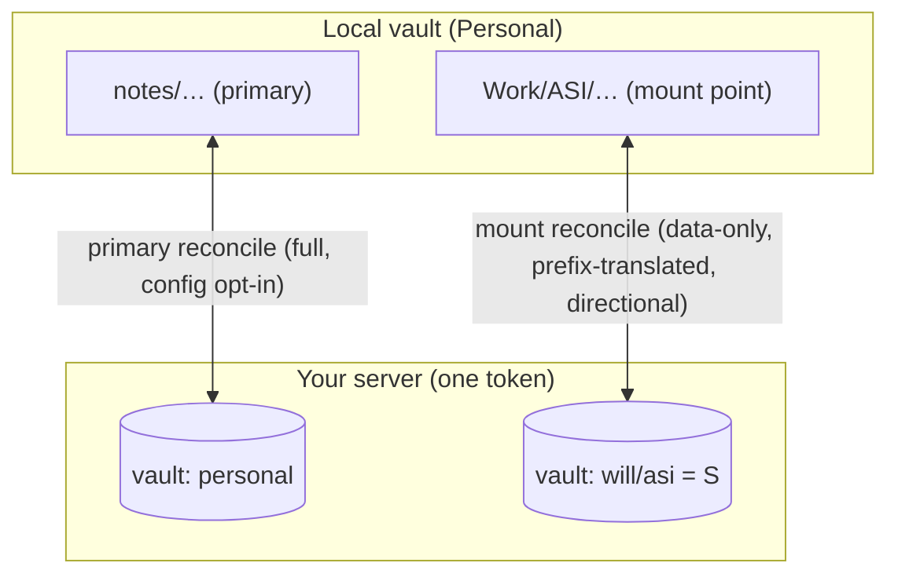
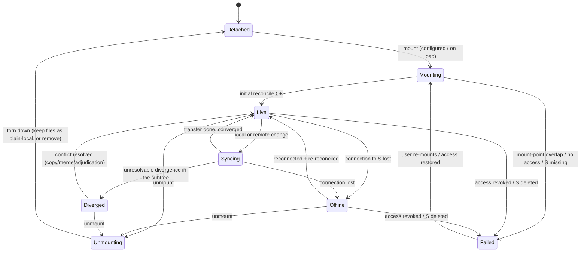

# Composed (nested) vaults — architecture / FSM / plan spike

**Status: SPIKE — design proposal, NOT yet accepted for build.** Realizes `nComposedVaults` (pinned
2026-08-07). Per CLAUDE.md §4, this architecture needs explicit human acceptance before any implementation;
this document is the proposal + the open questions to resolve first.

## 1. Goal & requirements (from the pinned Need)

Let a shared **part** of one vault appear inside **another** vault, so data lives side by side:

- **Directional.** My *personal* vault pulls in my *ASI* notes; my *ASI* vault does **not** pull in personal.
- **Composed.** The mounted notes are ordinary Obsidian files in a subfolder — search, links, Dataview,
  graph all work across the composed data.
- **DATA ONLY** (notes/attachments). Never config/plugins: when two vaults compose, *which* vault owns a
  plugin's settings is indeterminate, so config is deliberately out of scope (the insight that makes this
  tractable).
- No known Obsidian plugin does this; SelfSync is well-positioned because it already maps a vault ↔ a server
  vault, so "a subfolder ↔ a *shared* server vault" is a natural extension of the existing engine.

## 2. The model — **Mounts**

A **Mount** binds a **source server-vault** `S` to a **local subfolder** (the *mount point*) of the primary
vault, syncing **data only**, in a chosen **direction**:

```
Mount = {
  source:     { owner, vaultId },   // the server-vault S to compose in (owned by you, or shared to you)
  mountPoint: "Work/ASI",           // local subfolder of the primary vault
  direction:  "pull" | "sync",      // pull = S→local only (read-only); sync = bidirectional
}
```

A vault has ONE primary sync target (today's behaviour) **plus** zero or more mounts. Example: Personal vault
syncs to `personal` normally, and mounts `will/asi` at `Work/ASI` in **pull** mode → ASI notes appear under
`Work/ASI/…`, kept current, never pushed back.

**Key reframing:** a mount is "sync a (shared or own) vault into a **subfolder**, instead of as the **whole**
vault, and **data-only**." SelfSync already syncs a shared vault as a whole local vault; a mount reuses that
engine, scoped + prefix-translated + config-stripped. Same server, same token — only the vault scope + local
prefix differ.

## 3. Architecture

### 3.1 Multi-scope reconcile

Today the client runs ONE reconcile scope (whole local vault ↔ primary server vault). Composition generalises
to **N scopes**:

- **Primary scope:** local vault **minus every mount point** ↔ primary server vault (unchanged behaviour,
  config opt-in).
- **Mount scope (per mount):** local `<mountPoint>/**` (notes/attachments only) ↔ source vault `S`
  (data-only, prefix-translated, directional).

Each scope owns its own **base store** (last-synced ancestor for its subtree), **cursor/version**, **WS+poll
subscription** (to its vault), and **conflict handling** — all the existing machinery, instantiated per scope.



### 3.2 Boundary — no double-sync

The **primary** scope's `accepts()` filter must **exclude** every `<mountPoint>/**` path, so the mounted files
sync *only* through their mount scope and never leak into the primary server vault (which would double-store +
conflict). Each mount owns its subtree exclusively. Mount points may not overlap each other or nest (v1).

### 3.3 Path translation — `MountedIo`

The reconcile operates in **S-relative** paths; a thin adapter wraps `VaultIo` to add/strip the mount prefix:

- pull: server file `notes/a.md` (S-relative) → write local `Work/ASI/notes/a.md`.
- push: local `Work/ASI/notes/a.md` changed → commit to S as `notes/a.md`.

So the engine is unchanged; only the IO endpoints are prefix-mapped. Local enumeration for the mount scope is
a **scoped walk of `<mountPoint>/`** (cheap — reuse `walkConfigTree`'s bounded walk over any root).

### 3.4 Data-only enforcement

The mount scope's `accepts()` rejects any `.obsidian/**` path in **both** directions, and the mount's server
manifest is filtered to notes/attachments. A mount never carries config, so plugin/settings ownership is never
in question. (If `S` happens to hold config, the mount simply ignores it.)

### 3.5 Direction

- **pull** (read-only mount): reuse the existing read-only-vault path (`vaultReadOnly`) scoped to the mount —
  pulls S→local, **never** pushes. Safe default (Personal pulling ASI can't accidentally mutate ASI).
- **sync** (bidirectional): the normal reconcile scoped to the subtree — edits in the mount propagate to `S`
  (and thence to the source vault + its other consumers), with the usual conflict machinery.

### 3.6 Auth

Same server, so the **existing token is reused**; a mount just needs *access* to `S` — either you own it, or
it's shared to you (the existing grant/share model). Mounting a shared vault into a subfolder is the same
authorisation as syncing it as a whole vault today. (Cross-**server** composition is out of scope for v1.)

## 4. FSM model

### 4.1 Per-mount lifecycle

Each mount is an independent state machine (composed under the shared connection FSM, which owns
connect/auth to the server):



| State | Meaning | Enters on | Leaves on |
|---|---|---|---|
| **Detached** | configured but inactive (or unconfigured) | init / after unmount | `mount` |
| **Mounting** | initial reconcile: pull S's tree into the mount point (+ push local-only if `sync`) | mount command / load | reconcile ok → Live; error → Failed |
| **Live** | in sync, watching | initial/refresh reconcile ok | change → Syncing; drop → Offline; unmount |
| **Syncing** | active transfer (sub-status of Live for the status light) | change detected | done → Live; conflict → Diverged; drop → Offline |
| **Diverged** | an unresolved conflict in the subtree, awaiting adjudication | conflict detected | resolved → Live |
| **Offline** | S unreachable (backoff/retry) | connection lost | reconnect → Live |
| **Unmounting** | tearing down; **choice: keep the files as plain-local, or remove them** | unmount command | done → Detached |
| **Failed** | hard error (overlap, access revoked, S deleted) | fatal condition | user fix / re-mount → Mounting |

Guards: the `pull`-direction machine never takes the push side of a transfer; the data-only filter is always
on; `Mounting`/`Live` require the shared connection FSM to be connected.

### 4.2 Aggregate status (the one status light)

The vault's overall status is a **fold** of the primary scope's state and every mount's state:

- **Fully synced** ⟺ primary `idle` **and** every mount `Live`.
- **Syncing** if any scope is transferring.
- **Needs review** if any scope is `Diverged`.
- **Reconnecting** if any scope is `Offline`.
- **Attention** if any mount is `Failed`.

Settings shows a **per-mount** row (source vault · mount point · direction · state), so a stuck/failed mount is
legible without collapsing the headline.

## 5. Data model

Persisted per-device (mounts are a local composition choice, like the primary target — not synced):

```
settings.mounts: Mount[]   // { source:{owner,vaultId}, mountPoint, direction }
```

Each mount also needs its own persisted **base store** (namespaced by mount) so a restart doesn't re-hash the
subtree, mirroring the primary base's `size/mtime` scan-skip.

## 6. Conflict & deletion semantics

- **Conflict** (a file edited both in `S`'s source vault and via the mount, `sync` mode): the existing
  conflict-copy / three-way-merge machinery, scoped to the mount subtree — no new model.
- **Deletion:** in `pull` mode, a local delete under the mount point is **re-pulled** (S is authoritative;
  never destroys the source). In `sync` mode, a delete propagates to `S` (with the delete-rate guard intact).
- **Unmount:** an explicit choice — **keep** the mounted files as ordinary local files (decompose in place),
  or **remove** them (they remain safe in `S`). Never a silent delete.

## 7. Implementation plan (phased; each phase shippable + testable)

0. **Spike validation (no ship):** prove multi-scope reconcile + `MountedIo` prefix translation with a
   *read-only* mount against a throwaway `S` — the safest slice (no push-back, so `S` is never mutated).
1. **Mount data model + boundary:** `settings.mounts`, the primary scope's mount-point exclusion, overlap/nest
   guards, per-mount base store. Pure/unit-tested (path math, exclusion, overlap detection).
2. **Pull-only mount engine + FSM:** scoped+prefixed+data-only reconcile in `pull` mode reusing the read-only
   path; the per-mount FSM; the aggregate status fold. Ship read-only composition.
3. **Bidirectional (`sync`) mounts:** enable push + the scoped conflict machinery + delete propagation with the
   rate guard.
4. **UI:** add/remove a mount (pick the source vault from your accessible vaults + the mount point + direction),
   per-mount status rows, unmount keep-or-remove prompt.
5. **Edges:** offline/backoff per mount, access-revoked / S-deleted → Failed, unmount cleanup, migration of an
   existing whole-vault share into a mount.

Each phase carries its own independent security critique (composition touches data boundaries + deletion).

## 8. Risks & mitigations

- **Double-sync / leakage** (a mounted file also syncing to the primary vault): the primary `accepts()`
  exclusion is load-bearing — guard + test it hard (a mounted path must be provably absent from the primary
  scope).
- **Boundary drift** on mount-point rename/move: treat a mount-point move as unmount+remount; block editing a
  mount point in place.
- **Delete blast radius** (bidirectional): the existing cross-pass delete-rate guard applies per mount scope.
- **Resource** (N subscriptions): bounded — same server/token; poll cadence shared; cap the number of mounts.
- **Config bleed:** the data-only filter must be symmetric (reject `.obsidian/**` both directions) — test it.
- **Provenance interplay:** mounted files carry `S`'s authorship; the change-notification + push/pull provenance
  features already key on the authenticated author, so they compose without change.

## 9. Out of scope (v1)

- **Config/plugin composition** (indeterminate ownership — permanently out; data-only is the whole point).
- **Nested mounts** (a mount inside a mount) and **overlapping** mount points.
- **Cross-server** composition (a mount whose `S` is on a different server/token).
- **Per-user personal scope** on `S` — that's the separate `nPerUserConfigScope` spike.

## 10. Open questions (resolve before accepting for build)

1. **Direction default:** is your ASI-into-Personal case **pull-only** (read the ASI notes in Personal, edit
   them in ASI) or **bidirectional** (edit ASI notes from within Personal and have it propagate)?
2. **Granularity of `S`:** compose a **whole** source vault, or a **subfolder** of it (e.g. only
   `ASI/Projects/**`)? Sub-vault granularity is more powerful but adds a second prefix on the `S` side.
3. **Mount point collision:** if `Work/ASI/` already has local files when you mount, do we **merge** (treat as
   a first-contact reconcile) or require an **empty** mount point?
4. **Unmount default:** keep-as-local or remove?
5. **Scope for the first ship:** is Phase 2 (read-only composition) a satisfying v1 on its own, or is
   bidirectional table-stakes?
